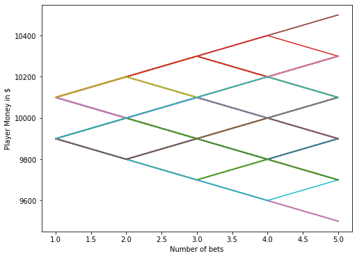
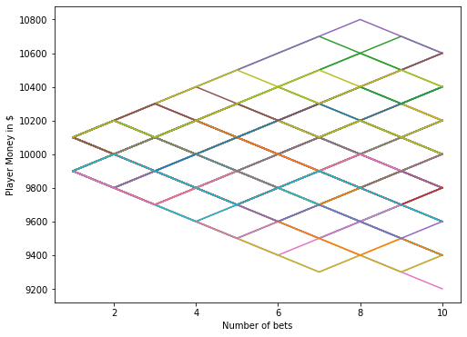
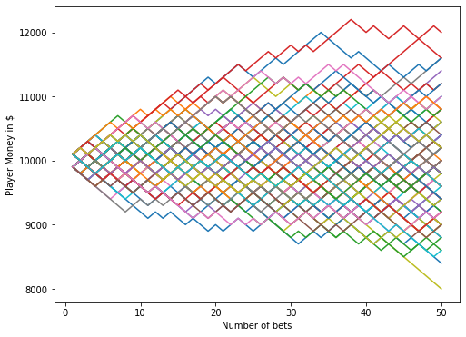
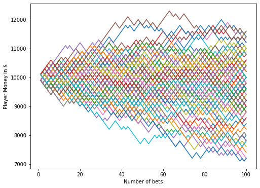
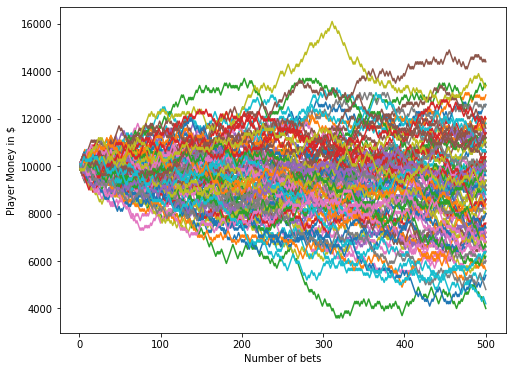
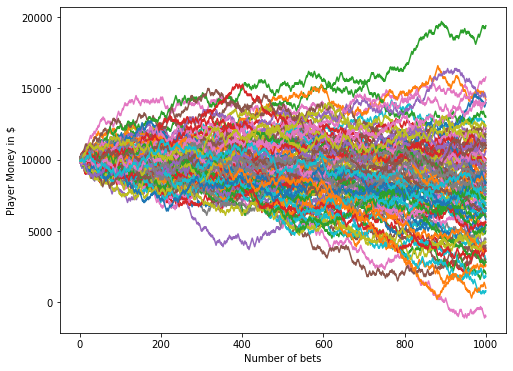
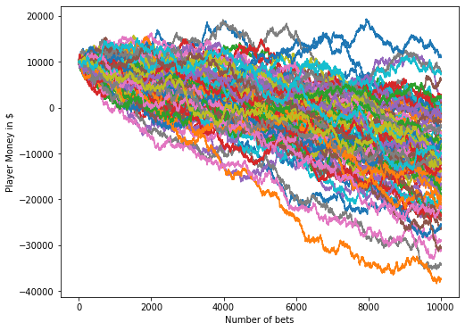

```python
import random
import matplotlib.pyplot as plt
```
## The die can take values from 1 to 100. If the number is between 1 and 51, the house wins. 
## If the number is between 52 and 100, the player wins.

```python


def rolldice():
    
    dice = random.randint(1,100)
    
    if dice <=51:
        return False
    elif dice >51 & dice <=100:
        return True
```
## Define a function for the play which takes 3 arguments :
## 1. total_funds = total money in hand the player is starting with
## 2. wager_amount = the betting amount each time the player plays
## 3. total_plays = the number of times the player bets on this game


```python

def play(total_funds, wager_amount, total_plays):
    
    #Create empty lists for :
    # 1.Play_number and 
    # 2.Funds available
    # 3.Final Fund
    Play_num = []
    Funds = []

    #Start with play number 1
    play = 1
    #If number of plays is less than the max number of plays we have set (100)
    while play <= total_plays:
        #If we win
        if rolldice():
            #Add the money to our funds
            total_funds = total_funds + wager_amount
            #Append the play number
            Play_num.append(play)
            #Append the new fund amount
            Funds.append(total_funds)
        #If the house wins
        else:
            #Add the money to our funds
            total_funds = total_funds - wager_amount 
            #Append the play number
            Play_num.append(play)
            #Append the new fund amount
            Funds.append(total_funds)
            
        #Increase the play number by 1
        play = play + 1
       
    plt.plot(Play_num,Funds)
    Final_funds.append(Funds[-1])
    return(Final_funds)
```

## Call the function to simulate the plays and calculate the remaining funds of the player after all the bets
## Intialize the scenario number to 1
## The number of bets here is 5.

```python

x=1
#Create a list for calculating final funds
Final_funds= []
plt.figure(figsize=(8,6)) 
while x<=100:
    ending_fund = play(10000,100,5)
    x=x+1

#Plot the line plot of "Account Value" vs "The number of plays"

plt.ylabel('Player Money in $')
plt.xlabel('Number of bets')
plt.show()

#Print the money the player ends with
print("The player starts the game with $10,000 and ends with $" + str(sum(ending_fund)/len(ending_fund)))
```





    The player starts the game with $10,000 and ends with $9978.0
    
## Call the function to simulate the plays and calculate the remaining funds of the player after all the bets
## Intialize the scenario number to 1
## The number of bets here is 10.

```python

x=1
#Create a list for calculating final funds
Final_funds= []
plt.figure(figsize=(8,6)) 
while x<=100:
    ending_fund = play(10000,100,10)
    x=x+1

#Plot the line plot of "Account Value" vs "The number of plays"
plt.ylabel('Player Money in $')
plt.xlabel('Number of bets')
plt.show()

#Print the money the player ends with
print("The player starts the game with $10,000 and ends with $" + str(sum(ending_fund)/len(ending_fund)))
```





    The player starts the game with $10,000 and ends with $9960.0
    

## Call the function to simulate the plays and calculate the remaining funds of the player after all the bets
## Intialize the scenario number to 1
## The number of bets here is 50.
```python

x=1
#Create a list for calculating final funds
Final_funds= []
plt.figure(figsize=(8,6)) 
while x<=100:
    ending_fund = play(10000,100,50)
    x=x+1

#Plot the line plot of "Account Value" vs "The number of plays"

plt.ylabel('Player Money in $')
plt.xlabel('Number of bets')
plt.show()

#Print the money the player ends with
print("The player starts the game with $10,000 and ends with $" + str(sum(ending_fund)/len(ending_fund)))
```





    The player starts the game with $10,000 and ends with $9924.0
    
## Call the function to simulate the plays and calculate the remaining funds of the player after all the bets
## Intialize the scenario number to 1
## The number of bets here is 100.

```python

x=1
#Create a list for calculating final funds
Final_funds= []
plt.figure(figsize=(8,6)) 
while x<=100:
    ending_fund = play(10000,100,100)
    x=x+1

#Plot the line plot of "Account Value" vs "The number of plays"

plt.ylabel('Player Money in $')
plt.xlabel('Number of bets')
plt.show()

#Print the money the player ends with
print("The player starts the game with $10,000 and ends with $" + str(sum(ending_fund)/len(ending_fund)))
```





    The player starts the game with $10,000 and ends with $9692.0
    
## Call the function to simulate the plays and calculate the remaining funds of the player after all the bets
## Intialize the scenario number to 1
## The number of bets here is 500.

```python

x=1
#Create a list for calculating final funds
Final_funds= []
plt.figure(figsize=(8,6)) 
while x<=100:
    ending_fund = play(10000,100,500)
    x=x+1

#Plot the line plot of "Account Value" vs "The number of plays"

plt.ylabel('Player Money in $')
plt.xlabel('Number of bets')
plt.show()

#Print the money the player ends with
print("The player starts the game with $10,000 and ends with $" + str(sum(ending_fund)/len(ending_fund)))
```





    The player starts the game with $10,000 and ends with $9012.0
    

## Call the function to simulate the plays and calculate the remaining funds of the player after all the bets
## Intialize the scenario number to 1
## The number of bets here is 1000.
```python

x=1
#Create a list for calculating final funds
Final_funds= []
plt.figure(figsize=(8,6)) 
while x<=100:
    ending_fund = play(10000,100,1000)
    x=x+1

#Plot the line plot of "Account Value" vs "The number of plays"

plt.ylabel('Player Money in $')
plt.xlabel('Number of bets')
plt.show()

#Print the money the player ends with
print("The player starts the game with $10,000 and ends with $" + str(sum(ending_fund)/len(ending_fund)))
```





    The player starts the game with $10,000 and ends with $8144.0
    
## Call the function to simulate the plays and calculate the remaining funds of the player after all the bets
## Intialize the scenario number to 1
## The number of bets here is 10000.

```python

x=1
#Create a list for calculating final funds
Final_funds= []
plt.figure(figsize=(8,6)) 
while x<=100:
    ending_fund = play(10000,100,10000)
    x=x+1

#Plot the line plot of "Account Value" vs "The number of plays"

plt.ylabel('Player Money in $')
plt.xlabel('Number of bets')


#Print the money the player ends with
print("The player starts the game with $10,000 and ends with $" + str(sum(ending_fund)/len(ending_fund)))
```

    The player starts the game with $10,000 and ends with $-11032.0
    





```python

```
